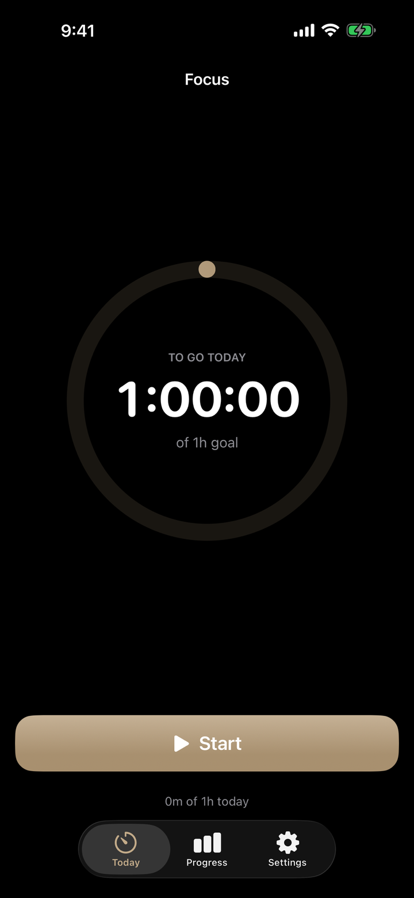

<!-- SDIT Tools · Focus -->

# Focus

**Attention & Deep Work** — a tool from the [San Diego Institute of Technology](https://sandiegotech.org).

The world is engineered to pull your attention away from what matters. Focus is an
app to help you get it back: press one button, watch a calm countdown toward your
daily goal, build the hours up over time, and work toward a reward you choose.
Discipline over motivation, accountability without the guilt trip.

> Part of [**SDIT Tools**](https://sandiegotech.org/tools/) — free, open-source software
> built for focus, privacy, and performance in the age of AI.
> **Free · Open Source · MIT Licensed · No accounts, no feed, no algorithm.**

Platforms: **iOS · macOS**



## Status — in testing

Focus is **currently in testing and not yet on the App Store**. The app builds and runs
today, and TestFlight builds go out to early testers as we polish it toward release.
If you would like to test it, write to
[brandon@sandiegotech.org](mailto:brandon@sandiegotech.org?subject=Focus%20Testing) and
we'll send you an invite. Blunt feedback and bug reports are the most useful
contribution at this stage. You can also build it from source — instructions below.

<p>&nbsp;</p>

## ⚠️ First: you need Xcode

This project is complete, but building an Apple app requires full **Xcode**, not just
the Command Line Tools.

1. Install **Xcode** (free) from the **Mac App Store**. It's a big download, so start it first.
2. After it installs, open it once and let it finish "Installing components."
3. (Optional, points the command line at Xcode):
   `sudo xcode-select -s /Applications/Xcode.app/Contents/Developer`

Requires **Xcode 16 or newer** (the project uses the modern synchronized-folder format).

<p>&nbsp;</p>

## Run it

### On the Simulator (easiest)
1. Open the project:  `open Focus.xcodeproj`
2. In the toolbar, pick a simulator (e.g. **iPhone 16**) from the device menu.
3. Press **▶ Run** (or ⌘R). First build takes a minute.

### On your iPhone
1. Plug in your phone and select it in the device menu.
2. Select the **Focus** target → **Signing & Capabilities** tab → set **Team** to your
   Apple ID (Xcode → Settings → Accounts to add it). A free Apple ID works.
3. The bundle id is `com.brandonnelson.focus`; if Xcode says it's taken, change it to
   something unique like `com.yourname.focus`.
4. Press **▶ Run**. On the phone, approve the developer profile under
   *Settings → General → VPN & Device Management* the first time.

### On your Mac
Select the **FocusMac** scheme and press **▶ Run**.

<p>&nbsp;</p>

## How it works

- **Today** — One big **Start / Pause** button and a ring. Starting counts a session;
  the ring fills and the center counts **down** toward today's goal. Pause anytime —
  your progress is saved, so the goal is chipped away across the day, never one daunting
  block. Hit the goal and you get a little celebration.
- **Progress** — All-time hours, days practiced, current streak, a 7-day chart, and your
  **reward** progress bar. Tap **+** to add or fix time by hand (in case you forgot to hit
  start — the app is forgiving on purpose).
- **Settings** — Add activities (name, icon, color, daily goal) and set each one's reward
  (e.g. *"Buy that pedal" after 100 hours*). Turn on a **gentle daily reminder** with a
  time of your choosing.

It ships with one starter activity so it's usable immediately.

<p>&nbsp;</p>

## Design

Focus follows the SDIT brand: a warm paper background, deep-ink text, and a calm
**marine** accent, with **gold** reserved for emphasis. The activity color palette and
app icon are drawn from the same system shared across Focus, Shade, and Scope, so the
tools feel like one suite. Brand tokens live in `Focus/Theme.swift` (`enum Brand`).

| Token | Hex | Use |
|-------|-----|-----|
| Paper | `#FCFBF8` | Background |
| Ink | `#101C2C` | Text / icon tile |
| Marine | `#234E70` | Primary accent |
| Gold | `#A8842C` | Emphasis |

<p>&nbsp;</p>

## Notes

- **Private & offline.** No accounts, no network. Your data is a single JSON file in the
  app's Application Support folder, on-device only (synced via iCloud key-value store).
- **Make it yours.** Daily goals, rewards, colors, and the reminder are all editable in the
  app — no code changes needed.

<p>&nbsp;</p>

## Project layout

```
Focus.xcodeproj          The Xcode project (Focus + FocusMac targets)
Focus/
  FocusApp.swift         App entry point
  Models.swift           Activity, FocusSession
  Store.swift            Data, persistence, timer logic, stats, reminders
  Theme.swift            SDIT Brand tokens + colors + time formatting
  RootView.swift         The three tabs
  TodayView.swift        The timer screen (ring + countdown + button)
  StatsView.swift        Progress: totals, chart, reward, recent sessions, add-time
  SettingsView.swift     Activities + reminder settings
  ActivityEditView.swift Add / edit an activity and its reward
  Components.swift       Ring, pills, stat cards, progress bar
  Assets.xcassets        App icon + accent color
```

<p>&nbsp;</p>

---

© San Diego Institute of Technology · 501(c)(3) nonprofit · Released under the MIT License.
